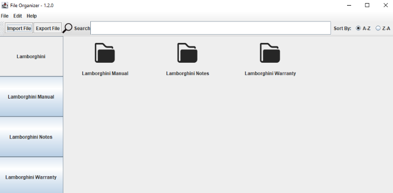

# teamname's FileViewer program
> A Fileviewer application for TCSS360 written in Java

## Table of Contents

- [Screenshot](#screenshot)
- [Installation](#installation)
- [Features](#features)
- [Team](#team)
- [Contact](#contact)
- [License](#license)

## Screenshot

## Installation

### To download source code:
`git clone https://github.com/teamname-tcss360/teamname-tcss360.github.io.git`

### To download jar:
Navigate to releases and download the latest version.

## Features
- Adding and storing documents
- Deleting documents
- Searching for documents
- Creating and loading profiles

## Team
* Michael Theisen
* Patrick Tibbals
* Jasharn Thiara
* Trevor Tomlin

## Contact
teamname.tcss360@gmail.com

## License
This project is licensed under the  MIT License - see the LICENSE file for details.
